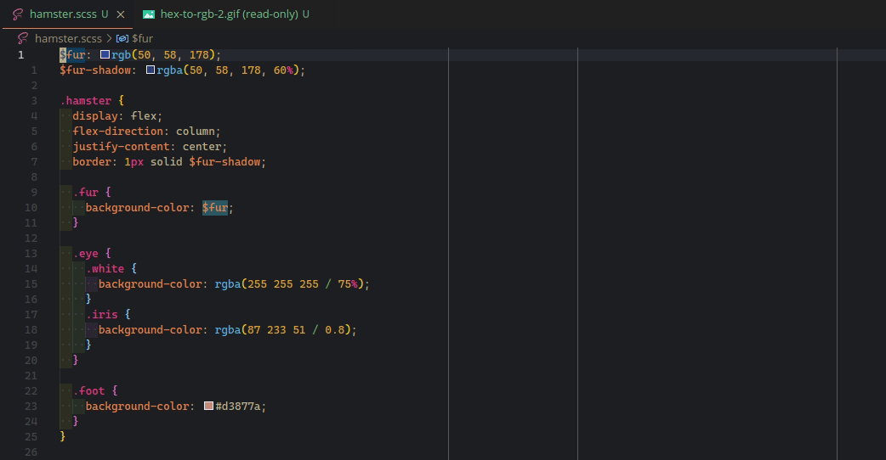

# Hex to RGB README

VSCode extension that converts colors between hex and RGB.

Uses the [`@nkp/color`](https://www.npmjs.com/package/@nkp/color) library.

[View on GitHub](https://github.com/NickKelly1/vsce-hex-to-rgb)

## Features

- Preserves alpha values
- Converts on cursor
- Converts all in selection
- Handles
  - rgb
  - rgba
  - comma separators
  - space separators
  - alpha percentages
  - alpha absolute values
  - hex3 (shorthand)
  - hex4 (alpha shorthand)
  - hex6
  - hex8 (alhpa)
- Can convert to RGBx numbers without the rgb css text wrapping

## Requirements

None.

## Extension Settins

None.

## Known Issues

None.

## Release Notes

### 1.0.0

Initial release of Hex-to-rgb
